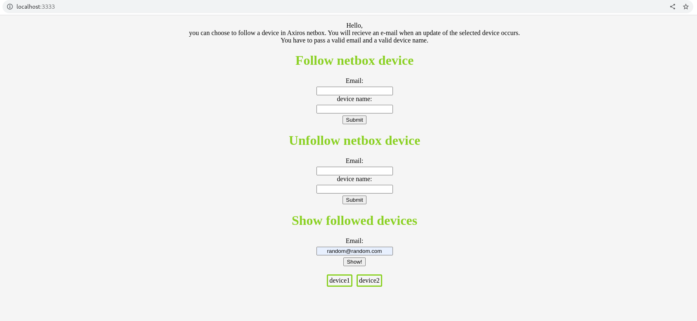

This is simple node.js app that allows users to subscribe to a device defined in netbox. 
Start this app and then create a webhook in netbox to send a post request to app-ip:3333/send

Data is saved to data.json in format of {email: [slug1, slug2, ...]}. This is not a secure app and should be accessible from the local network only.  
You should customise the body of an email and provide your own email account that will be used for sending an email. 
If you are using a gmail you should generate application password in settings/security as gmail no longer supports nodemailer with  
the original password.

Feel free to fork the project and add your own functionalities.   I might implement more precise subscription models (not only for device names) 
 
How it looks:    

